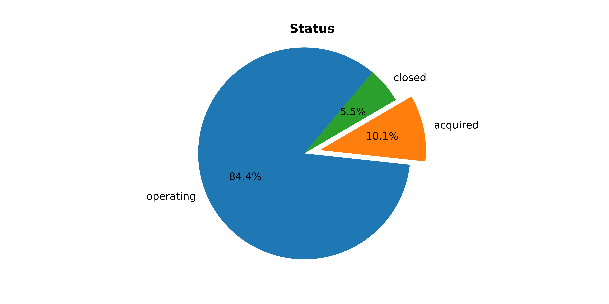

# Startup Investment

## Project Goal
The goal of my project was to try and predict the status of a company using the very limited information I had. Something I had to keep in mind was what information would a first investor know before a deal is reached. 

## Data Description
My data came from the data search tool kaggle and was a large set of information from Crunchbase. Crunchbase is a platform designed to help connect businesses with potential investors. On top of this Crunchbase allows for data extraction to do market research. My uncleaned data set included a total of 39 columns with a total of 54,294 rows.

After cleaning and feature engineering my data set was 33 columns by 20,862 rows.
A snippet of what some of my columns looked like is below. 
| Market       | Seed      | Venture    | Angel     | Time to Funding (days) | Status    |
|--------------|-----------|------------|-----------|------------------------|-----------|
| Other        | 1,750,000 | 0          | 0         | 29                     | acquired  |
| Biotechnolgy | 0         | 26,775,015 | 0         | 4,411                  | operating |
| E-Commerce   | 0         | 0          | 2,700,000 | 119                    | closed    |

## EDA
The first thing I wanted to know was what was the timeline of the my data. Specifically what are the number of business being founded every year as well as what were the number of deals being reached every year. The plot below highlights this. 

This plot led me to feature engineer the time to funding feature in my data set. 

The next thing I was curios about was looking at business per state as well as the business closed per state. To achieve this I used folium to plot these.

After both of these plots I wanted to take a look the status breakdown. 

As the plot above shows my targets are heavily weighted on the operating class. This plot made me reconginize that I would ultimately need to try and predict on something other than operating or not. After this plot I curious to know if all markets had similar distributions and I quickly discovered they did not. Ultimately I ended up making plots for twenty different markets. In the plots below I wanted to highlight some of the biggest difference I saw. 

Because of these kinds of differences, I decided to feature engineer the market category to be the most prevelant twenty categories or to be classified as other. The first ten of these are shown below. Ultimately my top twenty made up a total of 56.74% of the entire market. 

 

