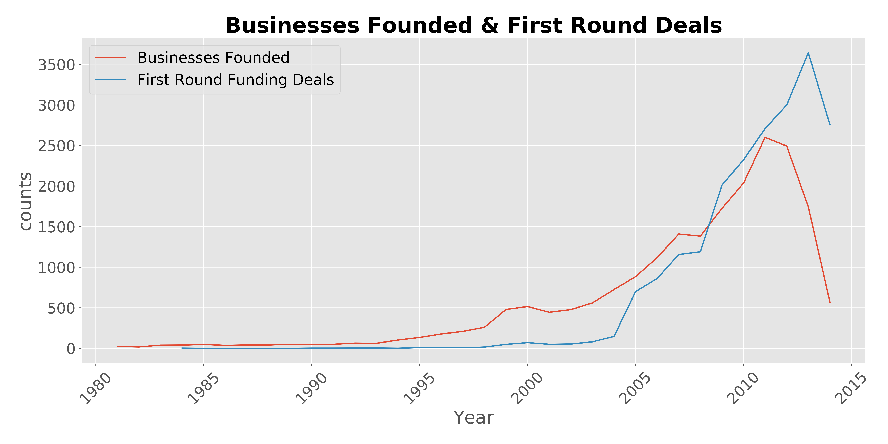
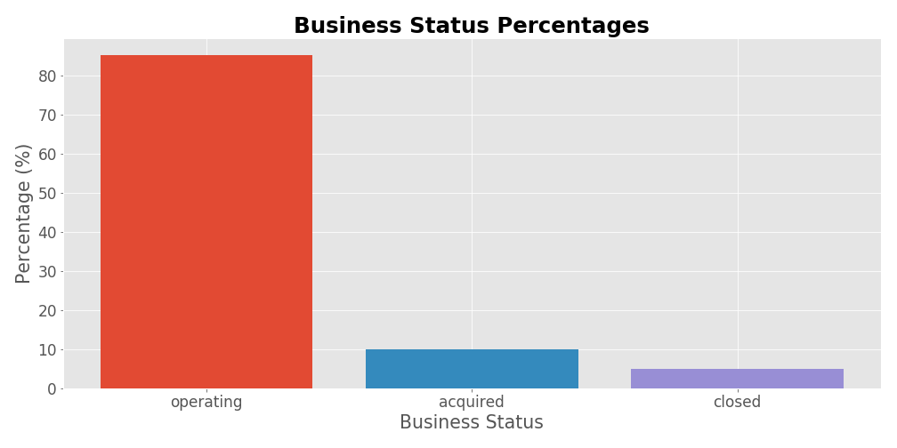
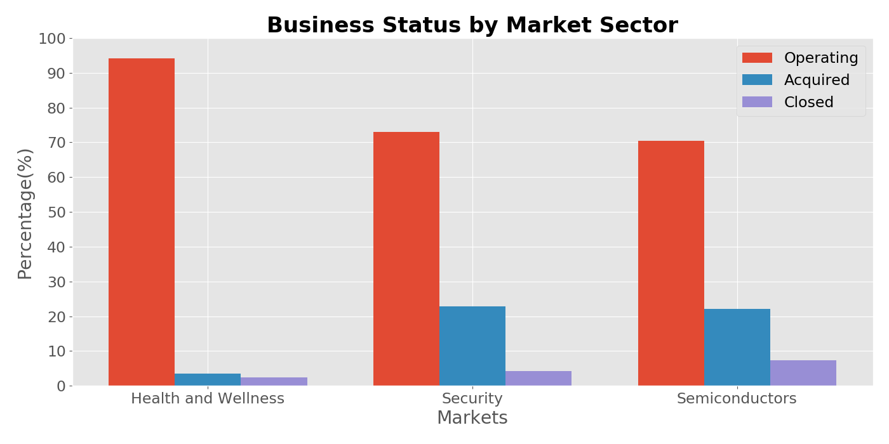

# SEE THE SLIDE DECK HERE!!!
https://docs.google.com/presentation/d/1UBd2-2u5tFSVZUrDOU8wHlK_WMfWhi24b58eVzkUw8M/edit?usp=sharing

# Startup Investment

## Background
* 77% of small businesses rely on personal savings for their initial funds.
* A third of small businesses start with less than $5,000.
* The average small business requires about $10,000 of startup capital.
* Only 0.05% of startups raise venture capital.
* The average seed round is $2.2 million.
* The median company running a seed funding round is 3 years old.
* Of startups that raised seed rounds, 1% reached unicorn status of $1B valuation.
* Startups with two co-founders rather than one raise 30% more capital.

## Project Goal
The goal of my project was to try and predict the status of a company using the very limited information an investor would know before the first round of funding. 

## Data Description
My data came from the data search tool kaggle and is a large set of information from Crunchbase. Crunchbase is a platform designed to help connect businesses with potential investors. On top of this Crunchbase allows for data extraction to do market research. My uncleaned data set included a total of 39 columns with a total of 54,294 rows.

To clean my data I used pandas. I choose pandas because of how easy it is to add columns and remove blanks rows. After cleaning and feature engineering my data set was 21 columns by 20,862 rows. A table with an explanation of my data can be seen below. 

| Column Name          | Data Type | Description                                |
|----------------------|-----------|--------------------------------------------|
| Status               | String    | Operating, Acquired, Closed                |
| State Code           | String    | Two digit state codes                      |
| Funding Rounds       | Integer   | Number of funding rounds completed         |
| Founded At           | Date      | Date of business founding                  |
| First Funding At     | Date      | Date of business funding                   |
| Seed                 | Float     | Seed funding in dollars                    |
| Venture              | Float     | Venture funding in dollars                 |
| Equity Crowd Funding | Float     | Crowd equity funding in dollars            |
| Undisclosed          | Float     | Funding raised not disclosed as type       |
| Convertible Note     | Float     | Funding raised by issuing convertible debt |
| Debt Financing       | Float     | Funding raised through debt                |
| Angel                  | Float  | Angel investing funding                                   |
| Grant                  | Float  | Grants received as funding                                |
| Private Equity         | Float  | Money raised from private equity firms                    |
| Post IPO Equity        | Float  | Money raised through equity after initial public offering |
| Post IPO Debt          | Float  | Money raised through debt after initial public offering   |
| MarketSecondary Market | Float  | Funding raised through selling currently owned securities |
| Product Crowd Funding  | Float  | Money raised by promising future product                  |
| Market                 | String | Market sector where company currently operates            |
| Time to Funding        | Int    | Days between founded date and first funding date          |

## EDA
The first thing I wanted to know was what was the timeline of my data. Specifically what is the number of businesses being founded every year as well as what was the number of deals being reached every year. The plot below highlights this. 

This plot led me to feature engineer the time to funding feature in my data set. 

The next thing I was curious about was looking at business per state as well as the business closed per state. To achieve this I used folium to plot these.

After both of these plots, I wanted to take a look at the status breakdown. I knew my status was going to be my target but I wanted to get a sense of how the data looked.

As the plot above shows my targets are heavily weighted on the operating class. This plot made me recognize that I would ultimately need to try and predict something other than operating or not. After this plot I curious to know if all markets had similar distributions and I quickly discovered they did not. Ultimately I ended up making plots for twenty different markets. In the plot below I wanted to highlight the three biggest differences I saw. 

Because of these kinds of differences, I decided to feature engineer the market category to be the most prevalent twenty categories or to be classified as other. The first ten of these is shown below. Ultimately my top twenty made up a total of 56.74% of the entire market. 

Continuing on this path of looking at how select features impacted my ultimate target of status I decided to look at the different types of capital being raised. While in general, the splits were not as drastic as the market splits were, there were some interesting oddballs. Two of them are highlighted in the plot below. 

## Model Preparation 
Because of the plots above, I decided to feature engineer funding into dummy variables because an initial investor would not know how much money is going to be raised before investing. I also chose to one hot encode my targets where one represented being acquired and zero represented operating or closed. After these modifiactions and before I could perform any sort of model creation I had to find a way to balance handle the imbalanced classes. I decided to use the SMOTE technique on the training data after the test train split.

### Baseline
For my baseline model, I went with a simple logistic regression. I also decided on using the metrics of accuracy and precision. I decided precision would be best for the imbalances in my classes because the worst-case scenario would be predicting a business would be acquired when in reality it might not be. The output of my baseline model can be seen below. 

|                | Train Set Value | Test Set Value |
|----------------|-----------------|----------------|
| Accuracy       | 67.55%          | 65.27%         |
| Precision      | 66.21%          | 17.78%         |

### Model Selection
For my model, I used a random forest classifier. As you can see from the values below most likely my model became overfit in an attempt to learn the signal. The test values did, however, do better than what my baseline model did and for this reason, I count this as a success. 

|                         | Train Set Value | Test Set Value |
|-------------------------|-----------------|----------------|
| Random Forest Accuracy  | 91.43%          | 86.29%         |
| Random Forest Precision | 92.36%          | 21.96%         |

In the plot below we see the top ten values for feature importances. It is important to note that these feature importances are not the effect size and they are not the direction of a feature.

### Practical Use
One possible practical use I see for this model would be an initial screen for firms interested in investing in companies that show the potential of being acquired. Then after this model identifies potential companies that will be acquired taking a deeper dive into specifics for the company. 

### Conclusion
In conclusion, the biggest indicators of whether or not a company will be acquired for the different categories used as my predictors are seeking venture funding, the spread of days from founding to seeking funding, if the company is based in California and finally if they are a software company or not.

## Areas Of Future Improvement
* Change threshold value for success 
    - to raise precision
* Try different class balancing techniques
    - class weights 
* Try different Models
    - XGBoost
    - Adaboost
* Try to add in more features
    - Volatilty Index (VIX)
    - Bond Interest Rates
    - Fear and Greed Index
* Multinomial prediciton
    - Predict acquired, closed, operating
* Run models to predict other outcomes
    - Total investment recieved
    - Number of rounds

## Learn More
* Private Equity Changes Everything
    - https://www.institutionalinvestor.com/article/b1hlsmsy1jpgtf/Private-Equity-Changes-Everything
    
* Software companies are spending billions on acquisitions, but how long will it last?
    - https://www.marketwatch.com/story/software-companies-are-spending-billions-on-acquisitions-but-how-long-will-it-last-2019-09-03

* What I Learned Each Time My Startups Got Acquired
    - https://medium.com/@jproco/what-i-learned-each-time-my-startups-got-acquired-b6be1fa407bc

